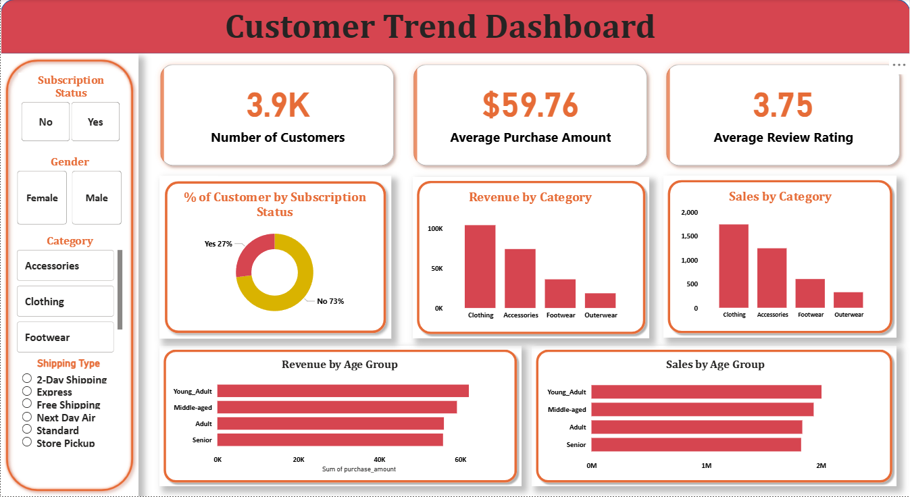

# Customer Shopping Trend Data Analysis

## Project Overview
A E-commerce retail company aims to better understand its customer's shopping behavior to improve sales, customer satisfaction, and long-term loyalty. This project analyzes consumer data to uncover patterns and actionable insights that can help optimize marketing strategies, product offerings, and customer engagement.
## Business Objective
The goal of this project is to answer the following key question:  
<b> “How can the company leverage consumer shopping data to identify trends, improve customer engagement, and optimize marketing and product strategies?” </b>
## Project Deliverables
1. Data Loading & Transformation (Python): [Data Loading & Transformation Script](Cus)
    - Clean, preprocess, and transform raw consumer data for analysis.
    - Handle missing values, outliers, and inconsistent records.
    - Create derived features for deeper insights (e.g., customer loyalty score, purchase frequency).
2. Data Analysis (SQL):
    - Store and organize data in a relational format.
    - Simulate business transactions for analysis.
    - Use SQL queries to extract key insights on:
        - Customer demographics
        - Buying patterns
        - Product preferences
        - Loyalty segmentation
3. Visualization & Insights (Power BI):
    - Build an interactive dashboard to visualize customer trends, seasonal variations, and purchasing behaviors.
    - Enable stakeholders to explore metrics dynamically.
    - Highlight KPIs like average order value, repeat purchase rate, and top-performing categories.
## Tools & Technologies
1. Programming Language: Python (Pandas)
2. Database & Queries: SQL (MySQL)
3. Data Visualization: Power BI
## Data Visualization With Power BI

## Connect With Me: [LinkedIn](https://www.linkedin.com/in/suranjandey/)
